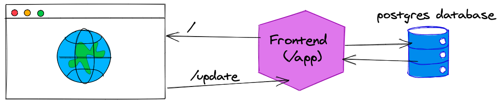

# Overview

Spend no more than 90 minutes to complete the project. If you reach 90 minutes before you are done, that’s okay! Send what you have. We want to respect your unpaid time and use this timebox to help do so.

You can research however you wish, ask us questions, ask your friends questions, just please do all the work yourself.

Keep in mind that many of our customers are self-hosted, so we have to reconcile our knowledge with their configurations and that can leave us with more questions than answers.

Honor the guiding principles for the team (listed in the job posting), trust your instincts, and go for it!

## Application Overview

This application is a simple todo list application run and deployed with Docker compose.

## Goal

The customer reports that the TODOs that he writes don't seem to be saved in the application whenever he closes his browser tab. Your job is to root cause this and fix the issue, and document your process for doing so.

**Hint**: You will not need to modify any of the Go files (.go) or
Javascript (*.js) files to complete this project.

## Architecture diagram



## Set up instructions

This application requires the following programs on your computer to run:

1. [Docker](https://docs.docker.com/get-docker/)
2. [docker-compose](https://docs.docker.com/compose/install/). **Note**: We specifically use the `docker-compose` binary - _not_ the `docker compose` sub-command that may or may not be available on your system. The link above provides instructions specifically for installing the `docker-compose` binary.

To start the application:

1. Open a terminal
2. Navigate to the folder containing `docker-compose.yaml`
3. Run `docker-compose up --build -d` to build the application and run it.

After this process has completed, you should be able to access the TODO application by opening your web browser and navigating to:

```
http://localhost:8080
```
